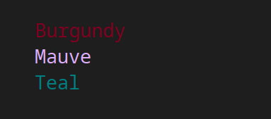

# termx-markup


[](https://www.npmjs.com/package/termx-markup)


## Usage

### Print markup

```tsx
import { Output, html } from "termx-markup";

Output.setDefaultPrintMethod(console.log); // (optional) print using console.log

const markup = html`
  <span bold color="red">
    Hello
    <pre color="blue"> in my </pre>
    world!
  </span>
`;

Output.println(markup);
```

#### Output:


### Only formatting

```tsx
import { MarkupFormatter, html } from "termx-markup";

const markup = html`
  <span color="red">
    Hello
    <pre color="blue"> in my </pre>
    world!
  </span>
`;

const formatted = MarkupFormatter.format(markup);
// formatted = "\u001b[31mHello \u001b[34min my\u001b[0m\u001b[31m world!\u001b[0m"

console.log(formatted);
```

#### Output:


### Define custom colors

```tsx
import { Output, MarkupFormatter, html } from "termx-markup";

MarkupFormatter.defineColor("burgundy", "rgb(128, 0, 32)");
MarkupFormatter.defineColor("mauve", "#E0B0FF");
MarkupFormatter.defineColor("teal", { r: 0, g: 128, b: 128 });

const markup = html`
  <line color="burgundy">Burgundy</line>
  <line color="mauve">Mauve</line>
  <line color="teal">Teal</line>
`;

Output.print(markup);
```

#### Output:



## Supported tags

- `<span>` - regular text, trims white-space characters and removes end-line characters
- `<line>` - same as span, but prints a new line character at the end
- `<pre>` - preformatted text, all white-space characters will be preserved
- `<br />` - prints a new line character
- `<s />` - prints a space character
- `<repeat>` - repeats the content of the tag a specified number of times, accepts additional attribute `times` (number)

## Supported attributes

- `color` - color of the text (css-like rgb or a color name)
- `bg` - background color of the text (css-like rgb or a color name)
- `bold` - bold text (boolean)
- `dim` - dimmed text (boolean)
- `italic` - italic text (boolean)
- `underscore` - underlined text (boolean)
- `blink` - blinking text (boolean)
- `invert` - inverse color text (boolean)
- `strike` - strike-through text (boolean)
- `no-inherit` - prevents inheriting parent styles (boolean)

## Default available colors

- `red`
- `green`
- `yellow`
- `blue`
- `magenta`
- `cyan`
- `white`
- `lightRed`
- `lightGreen`
- `lightYellow`
- `lightBlue`
- `lightMagenta`
- `lightCyan`
- `lightWhite`
